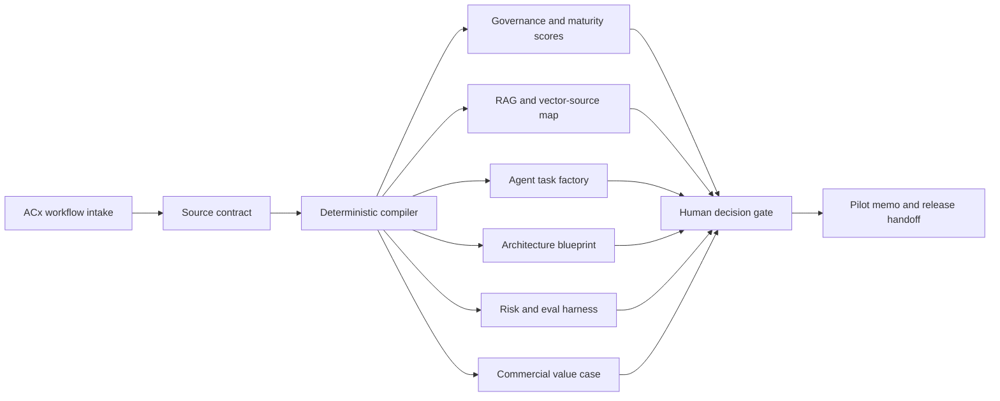

# Apply Digital AX Spec Compiler

Role-specific prototype for Apply Digital's Solution Architect, Agentic Engineering opening.

Live website: https://apply-digitalsolution-architect-age.vercel.app

GitHub repository: https://github.com/shrishmanglik/Apply-Digital

Claude Code sprint spec: [CLAUDE_CODE_FABLE_5_EXECUTION_SPEC.md](CLAUDE_CODE_FABLE_5_EXECUTION_SPEC.md)

## Overview

The AX Spec Compiler is a deterministic, boardroom-ready agentic delivery studio. It turns product, UX, content, component, brand, platform, data, and integration inputs into a governed implementation package for coding agents.

The upgraded prototype is designed to feel like something Apply Digital could convert into a real accelerator: a source contract, RAG map, agent task factory, architecture blueprint, risk register, evaluation plan, 30-day pilot memo, and commercial value case in one interface.

## Why This Prototype Exists

Apply Digital's role asks for a solution architect who can bridge business workflows, AI-enabled delivery, and practical engineering controls. This prototype focuses on that operating model:

- translate backlog, UX, content, component, and brand inputs into clear requirements
- score workflow readiness across business value, feasibility, risk, data sensitivity, architecture, governance, velocity, and hiring signal
- define knowledge-source, RAG, vector-store, and source-owner boundaries before agent handoff
- create coding-agent task packets with owners, non-goals, acceptance criteria, and QA checks
- map production architecture choices across Google ADK, Vertex AI, queues, caches, APIs, audit storage, and eval telemetry
- quantify the commercial case with annual value, pilot investment, payback, packaging, buyer map, and expansion triggers
- keep customer-facing, external, or sensitive actions behind human approval gates

The goal is not to show an open-ended chatbot. The goal is to show a controlled agentic delivery system that business, technical, QA, and delivery owners can trust.

## Client POV Review

From an Apply/client buyer perspective, the useful system is not one that simply generates specs. The useful system answers the buying and delivery questions that determine whether an enterprise AI workflow gets funded:

- Which workflow should we pilot first?
- What business value justifies the pilot?
- Who needs to approve data, brand, legal, technical, QA, and release decisions?
- What source material is required before agents can safely draft work?
- What runs in the client's environment, and what stays human-gated?
- How do we know this is different from an off-the-shelf AI tool?
- What evidence proves ROI, adoption, security, and production readiness?

The current version now includes a `Client plan` view specifically for those questions. It produces a decision memo, first workshop plan, 30-day launch plan, stakeholder commitments, KPI dashboard, and buyer FAQ.

## Live Demo

Production deployment:

https://apply-digitalsolution-architect-age.vercel.app

The demo opens with a retail campaign workflow and includes scenario presets for:

- ACx retail campaign delivery
- sports media matchday operations
- CPG content governance
- composable commerce migration
- internal agentic delivery desk

## How To Use The Demo

1. Open the live site.
2. Select the scenario closest to the client workflow.
3. Keep `Workflow brief` open for the high-level business goal, owners, and industry context.
4. Expand `Source package` only when you want to adjust channels, source inputs, knowledge sources, or integrations.
5. Expand `Governance` to tune data sensitivity, approval model, delivery stage, success metric, and risk notes.
6. Expand `Value model` to adjust workflow volume, cycle time, team cost, launch value, rework rate, and pilot budget.
7. Use `Command brief` and `Value case` for executive conversation.
8. Use `Client plan` for the decision memo, the client readiness board, the prioritized next-action queue, and what the organization must do in the first 30 days.
9. Use `Architecture`, `RAG + tools`, `Risk + QA`, and `Scale plan` for technical and delivery review.
10. Use `Role proof` and `Demo mode` for interview conversation and a five-minute boardroom run-of-show.
11. Use `Copy packet` or `Download .md` (top of the compiled package) to export the full client packet as Markdown for sponsor, legal, engineering, and delivery follow-up.
12. Use `Download work orders` to export the issue-ready agent work-order bundle as JSON.
13. Use `Copy share link` to create a URL that restores the current intake in another browser session.
14. Expand `Saved scenarios` to snapshot the current intake, restore or delete earlier snapshots, and compare the current configuration against a saved one. Snapshots persist in the browser only (`localStorage`); `Reset preset` returns to the selected scenario preset.

## Working-Session Features

- **Client packet export.** One click produces a deterministic Markdown packet: executive brief, readiness scorecard, value case, decision memo, next-action queue, launch plan, architecture summary, risk register, QA gates, autonomy boundaries, and the recorded intake assumptions. Copy it to the clipboard or download it as a `.md` file named after the workflow.
- **Scenario snapshots and compare.** Save up to 8 intake snapshots locally, restore or delete them, and compare the current intake against any snapshot across readiness, business value, risk, governance confidence, annual value, payback, autonomy recommendation, and approval model - with direction-aware shift labels (better / worse / changed).
- **Next-action queue.** The compiler emits a prioritized queue (Now / Next / Scheduled) generated from the weakest readiness dimensions, governance posture, missing source inputs, and value-model gaps. Every action carries an owner, rationale, required evidence, due window, and success signal. The pilot budget ask only appears when readiness clears the threshold, the value case is fundable, and no blocking action is open.
- **Client readiness board.** Six dimensions - business case, source grounding, governance, integration path, adoption, and delivery runway - summarize pilot readiness with status, score, owner, concern, evidence, and next move.
- **Shareable intake state.** `Copy share link` encodes the current intake into the URL hash, validates it with the same sanitizer used for snapshots, and restores it without server persistence.
- **Five-minute demo mode.** A boardroom run-of-show helps tell the product story quickly: workflow, money, governance, action queue, and portable artifacts.
- **Production control plane.** The `RAG + tools` view now includes connector contracts, eval telemetry, and release gates so each integration has an owner, auth scope, blocked action list, failure mode, evidence requirement, and promotion decision.
- **Agentic delivery factory.** The `Agent spec` view now emits issue-ready work orders and an evidence ledger, and `Download work orders` exports a JSON bundle that can seed GitHub Issues, Linear, Jira, or coding-agent task queues.
- **Enterprise workspace control room.** The `Scale plan` view now models tenant strategy, access roles, environment promotion, collaboration cadence, audit streams, escalation path, and workspace readiness for real account rollout.

## Feature List

The prototype compiles an intake package into:

- an executive command brief
- a million-dollar value case with annual value, pilot payback, and commercial packaging
- a client decision memo with sponsor ask, data position, adoption position, and first workshop plan
- a client readiness board with owner, evidence, concern, and next move per dimension
- a prioritized next-action queue with owner, rationale, evidence, due window, and success signal per action
- an exportable Markdown client packet (copy to clipboard or download as `.md`)
- local scenario snapshots with restore, delete, and direction-aware comparison
- shareable URL state for restoring the current intake
- a coding-agent-ready implementation contract
- business value, feasibility, risk, data-sensitivity, and readiness scores
- strategic fit, architecture readiness, governance confidence, delivery velocity, and hiring-signal scores
- a recommended autonomy mode and next best action
- RAG, vector-store, and knowledge-source maps
- tool and API action plans with evidence requirements and approval gates
- connector contracts with permitted actions, blocked actions, auth scope, data boundary, failure mode, and promotion gate
- eval telemetry for source coverage, approval integrity, task specificity, connector safety, value instrumentation, and release confidence
- release gates for source packet acceptance, governance, connectors, value case, and pilot launch authorization
- issue-ready agent work orders with priority, system scope, evidence, release gate, rollback plan, and blocked-until condition
- evidence ledger for source contracts, API/connector packs, approval SLAs, eval reports, and finance-accepted value models
- enterprise workspace control room with role permissions, environment promotion rules, collaboration cadence, audit retention, and escalation path
- first-batch backlog tasks with owners, non-goals, and acceptance criteria
- production architecture blueprint for agent orchestration, GCP services, queues, caching, APIs, and auditability
- 30-day pilot plan with phase gates
- client launch plan with client actions, Apply actions, and evidence expectations
- stakeholder commitment map for sponsor, product/CX, brand/legal, engineering/security, and QA/analytics
- success dashboard with targets, owners, and evidence sources
- buyer FAQ covering pilot purgatory, data ownership, security, AI expertise, off-the-shelf tool differentiation, and funding case
- scale plan with product roadmap and repeatable offer path
- risk register, QA checks, and evaluation checklist
- boardroom objection handling for buyers and interviewers
- role-fit proof matrix linking the prototype to Shrish's resume and the Apply Digital job requirements
- release handoff notes and a five-minute demo mode
- a visible runtime audit trail

## Product Principles

- Deterministic first: rules and templates control scoring, boundaries, and task generation.
- Human accountable: agents draft bounded work, but owners approve writes, publishing, and external actions.
- Source grounded: every task should trace back to product, UX, content, design, API, analytics, or governance inputs.
- Enterprise safe: privacy, accessibility, SEO/GEO, performance, and rollback checks are part of the delivery package.
- Interview ready: the interface doubles as a whiteboard artifact for discussing Apply Digital client workflows.

## Research Anchors

- Apply positions itself as an Agentic Customer Experience partner.
- TORQ AI is described as a production-ready, Google Cloud-powered agentic accelerator for CPG, retail, sports, and media enterprises.
- TORQ AI buyer concerns include ROI, pilot progression, data ownership, security, AI expertise, brand consistency, and how an engagement works.
- Public Apply material emphasizes 30-day production readiness, measurable results, client-owned environments, adoption, and repeatable workflows.

## Architecture



The current implementation runs entirely in the browser. There are no runtime AI calls, no server-side persistence, and no autonomous external writes. The production blueprint describes how this could become a real Apply Digital accelerator using GCP, Vertex AI, Google ADK, queue-backed orchestration, caches, APIs, and audit/eval storage.

## Tech Stack

- Next.js 16
- React 19
- TypeScript
- Vitest
- Playwright
- Vercel

Core compiler logic lives in `lib/compiler.ts`. The interactive interface lives in `components/spec-compiler.tsx`. Deterministic support modules: `lib/action-queue.ts` (next-action queue), `lib/export-packet.ts` (Markdown client packet), and `lib/snapshots.ts` (scenario snapshots and comparison).

## Upgrade Highlights

- Added an exportable Markdown client packet with `Copy packet` and `Download .md` actions.
- Added local scenario snapshots with save, restore, delete, and current-vs-saved comparison.
- Added a deterministic next-action queue in the Client plan view, traceable to intake values.
- Reframed the app as an ACx command center instead of a generic spec form.
- Added Apply-aligned scenario presets for ACx retail, sports media, CPG content, composable commerce, and delivery operations.
- Added executive, architecture, RAG/tooling, pilot, risk/QA, role-proof, and interview walkthrough views.
- Added a Value Case view with annual value, payback, package pricing, buyer map, expansion triggers, and boardroom objections.
- Added a Client Plan view with decision memo, launch plan, stakeholder commitments, success dashboard, and buyer questions.
- Added a Scale Plan view with a million-dollar product roadmap and repeatable offer path.
- Added client packet export, scenario snapshots, shareable state, a client readiness board, and five-minute demo mode for real working sessions.
- Added production-control outputs: connector contracts, eval telemetry, release gates, and packet export coverage for operating controls.
- Added an agentic delivery factory with issue-ready work orders, evidence ledger, and JSON export.
- Added enterprise workspace/control-room modeling for access, environments, audit streams, collaboration cadence, and rollout governance.
- Added a role-fit matrix that connects the prototype to spec-driven development, RAG, AI coding agents, Google ADK/Vertex AI, GCP, distributed systems, and client-facing delivery.
- Streamlined the UI with compact scenario selection, calmer header signals, denser scoring, and collapsible intake sections for source, governance, and value-model controls.
- Added pure-CSS operations-console styling with no generated image assets.

## Local Development

```bash
npm install
npm run dev
```

Then open:

```text
http://localhost:3000
```

## Verification

Run the full verification suite:

```bash
npm run verify
```

Or run each gate separately:

```bash
npm run test
npm run build
npm run test:e2e
```

The Playwright suite is configured without screenshot, video, or trace artifacts. Visual treatment is pure CSS, with no generated image assets.

## Deployment

The production site is deployed on Vercel:

https://apply-digitalsolution-architect-age.vercel.app

Current GitHub work is tracked in the repository:

- repository: https://github.com/shrishmanglik/Apply-Digital
- default branch: `main`

## Update Practice

Every update to this prototype should also update GitHub:

1. make the product, code, or documentation change locally
2. run the relevant verification gate
3. commit the intended files only
4. push the active branch to `shrishmanglik/Apply-Digital`
5. redeploy to Vercel when the change affects the live experience

For documentation-only changes, the minimum gate is a Git status and diff review before committing. For product or code changes, run `npm run verify`.

## Candidate Context

Built by Shrish Manglik as a focused job-application prototype for the Apply Digital Solution Architect, Agentic Engineering role.

The prototype is designed to make the core interview conversation concrete: how to use AI aggressively while keeping deterministic controls, measurement, auditability, and human ownership intact.
