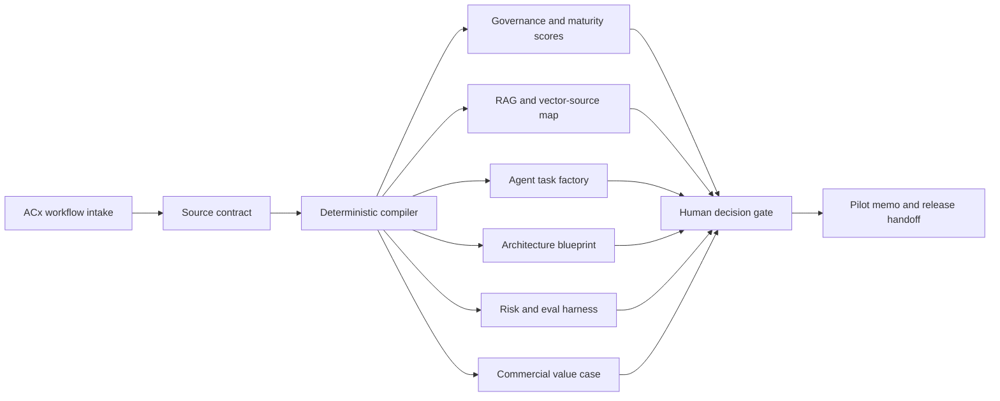

# Apply Digital AX Spec Compiler

Role-specific prototype for Apply Digital's Solution Architect, Agentic Engineering opening.

Live website: https://apply-digitalsolution-architect-age.vercel.app

GitHub repository: https://github.com/shrishmanglik/Apply-Digital

## Overview

The AX Spec Compiler is a deterministic, boardroom-ready agentic delivery studio. It turns product, UX, content, component, brand, platform, data, and integration inputs into a governed implementation package for coding agents.

The upgraded prototype is designed to feel like something Apply Digital could convert into a real accelerator: a source contract, RAG map, agent task factory, architecture blueprint, risk register, evaluation plan, 30-day pilot memo, and commercial value case in one interface.

## Why This Prototype Exists

Apply Digital's role asks for a solution architect who can bridge business workflows, AI-enabled delivery, and practical engineering controls. This prototype focuses on that operating model:

- translate backlog, UX, content, component, and brand inputs into clear requirements
- score workflow readiness across business value, feasibility, risk, data sensitivity, architecture, governance, velocity, and hiring signal
- define knowledge-source, RAG, vector-store, and source-owner boundaries before agent handoff
- create coding-agent task packets with owners, non-goals, acceptance criteria, and QA checks
- map production architecture choices across Google ADK, Vertex AI, queues, caches, APIs, audit storage, and eval telemetry
- quantify the commercial case with annual value, pilot investment, payback, packaging, buyer map, and expansion triggers
- keep customer-facing, external, or sensitive actions behind human approval gates

The goal is not to show an open-ended chatbot. The goal is to show a controlled agentic delivery system that business, technical, QA, and delivery owners can trust.

## Live Demo

Production deployment:

https://apply-digitalsolution-architect-age.vercel.app

The demo opens with a retail campaign workflow and includes scenario presets for:

- ACx retail campaign delivery
- sports media matchday operations
- CPG content governance
- composable commerce migration
- internal agentic delivery desk

## What It Does

The prototype compiles an intake package into:

- an executive command brief
- a million-dollar value case with annual value, pilot payback, and commercial packaging
- a coding-agent-ready implementation contract
- business value, feasibility, risk, data-sensitivity, and readiness scores
- strategic fit, architecture readiness, governance confidence, delivery velocity, and hiring-signal scores
- a recommended autonomy mode and next best action
- RAG, vector-store, and knowledge-source maps
- tool and API action plans with evidence requirements and approval gates
- first-batch backlog tasks with owners, non-goals, and acceptance criteria
- production architecture blueprint for agent orchestration, GCP services, queues, caching, APIs, and auditability
- 30-day pilot plan with phase gates
- scale plan with product roadmap and repeatable offer path
- risk register, QA checks, and evaluation checklist
- boardroom objection handling for buyers and interviewers
- role-fit proof matrix linking the prototype to Shrish's resume and the Apply Digital job requirements
- release handoff notes and interview walkthrough points
- a visible runtime audit trail

## Product Principles

- Deterministic first: rules and templates control scoring, boundaries, and task generation.
- Human accountable: agents draft bounded work, but owners approve writes, publishing, and external actions.
- Source grounded: every task should trace back to product, UX, content, design, API, analytics, or governance inputs.
- Enterprise safe: privacy, accessibility, SEO/GEO, performance, and rollback checks are part of the delivery package.
- Interview ready: the interface doubles as a whiteboard artifact for discussing Apply Digital client workflows.

## Architecture



The current implementation runs entirely in the browser. There are no runtime AI calls, no server-side persistence, and no autonomous external writes. The production blueprint describes how this could become a real Apply Digital accelerator using GCP, Vertex AI, Google ADK, queue-backed orchestration, caches, APIs, and audit/eval storage.

## Tech Stack

- Next.js 16
- React 19
- TypeScript
- Vitest
- Playwright
- Vercel

Core compiler logic lives in `lib/compiler.ts`. The interactive interface lives in `components/spec-compiler.tsx`.

## Upgrade Highlights

- Reframed the app as an ACx command center instead of a generic spec form.
- Added Apply-aligned scenario presets for ACx retail, sports media, CPG content, composable commerce, and delivery operations.
- Added executive, architecture, RAG/tooling, pilot, risk/QA, role-proof, and interview walkthrough views.
- Added a Value Case view with annual value, payback, package pricing, buyer map, expansion triggers, and boardroom objections.
- Added a Scale Plan view with a million-dollar product roadmap and repeatable offer path.
- Added a role-fit matrix that connects the prototype to spec-driven development, RAG, AI coding agents, Google ADK/Vertex AI, GCP, distributed systems, and client-facing delivery.
- Added pure-CSS operations-console styling with no generated image assets.

## Local Development

```bash
npm install
npm run dev
```

Then open:

```text
http://localhost:3000
```

## Verification

Run the full verification suite:

```bash
npm run verify
```

Or run each gate separately:

```bash
npm run test
npm run build
npm run test:e2e
```

The Playwright suite is configured without screenshot, video, or trace artifacts. Visual treatment is pure CSS, with no generated image assets.

## Deployment

The production site is deployed on Vercel:

https://apply-digitalsolution-architect-age.vercel.app

Current GitHub work is tracked in the repository:

- repository: https://github.com/shrishmanglik/Apply-Digital
- default branch: `main`

## Update Practice

Every update to this prototype should also update GitHub:

1. make the product, code, or documentation change locally
2. run the relevant verification gate
3. commit the intended files only
4. push the active branch to `shrishmanglik/Apply-Digital`
5. redeploy to Vercel when the change affects the live experience

For documentation-only changes, the minimum gate is a Git status and diff review before committing. For product or code changes, run `npm run verify`.

## Candidate Context

Built by Shrish Manglik as a focused job-application prototype for the Apply Digital Solution Architect, Agentic Engineering role.

The prototype is designed to make the core interview conversation concrete: how to use AI aggressively while keeping deterministic controls, measurement, auditability, and human ownership intact.
